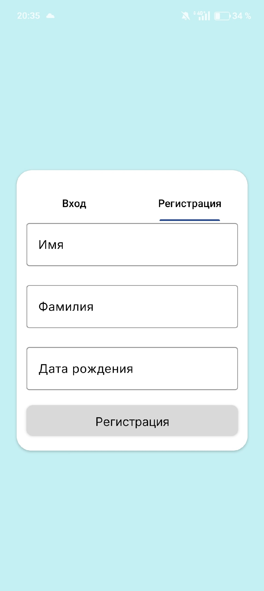

Визуальная часть приложения была создана в Android Studio.
На рисунках ниже представлен визуал приложения.

Рисунок 1 - Авторизация пользователя

Рисунок 2 - Регистрация пользователя

Рисунок 3 - Профиль пользователя

Рисунок 4 - Отзывы 

Рисунок 5 - Игры 

Рисунок 6 - Добавление нового обзора (проверка на добавление) 

Рисунок 7 - Проверка авторизации 1

Рисунок 8 - Проверка авторизации 2

Рисунок 9 - Форма добавления нового обзора 

Рисунок 10 - Форма добавления новой игры

Рисунок 11 - Изменение профиля пользователя
